# 🚀 CareerVerseAI

> An AI-powered all-in-one student career platform for roadmap planning, scholarships, resume analysis, AI mentoring, mock interviews, finance tracking, analytics, and personalized learning.

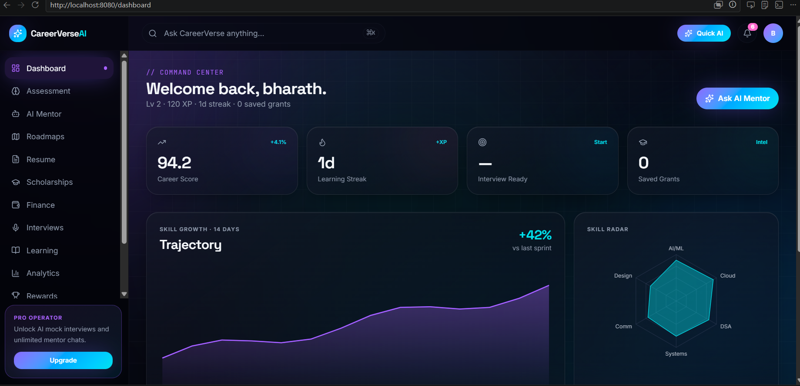

---

# ✨ Features

## 🎯 AI Mentor
- Smart career guidance chat interface
- Suggested prompts
- Multi-language support UI
- Chat history support

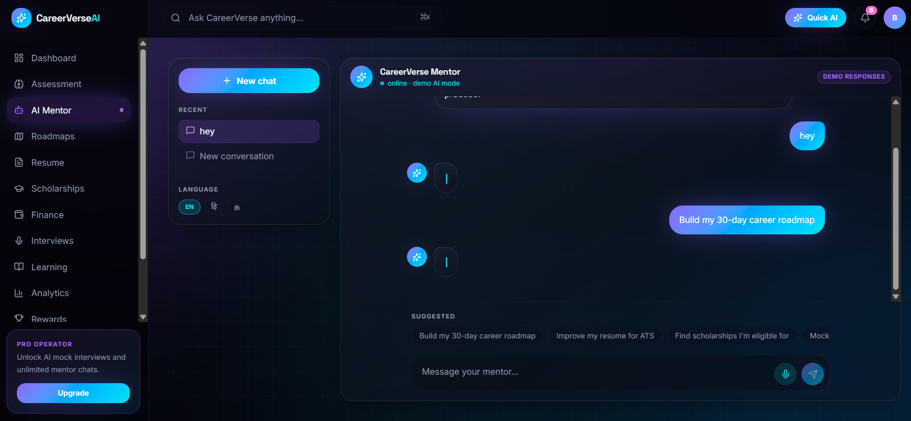

---

## 🧠 Resume Analyzer
- ATS score generation
- Skill gap analysis
- Resume insights dashboard
- Keyword matching visualization

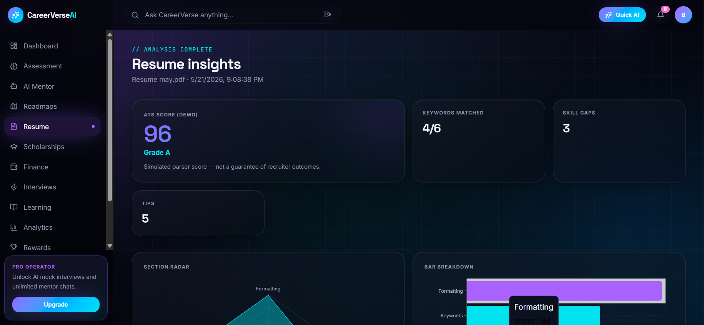

---

## 🎓 Scholarship Finder
- Scholarship filtering
- Category and income-based search
- Match percentage scoring
- Apply action support

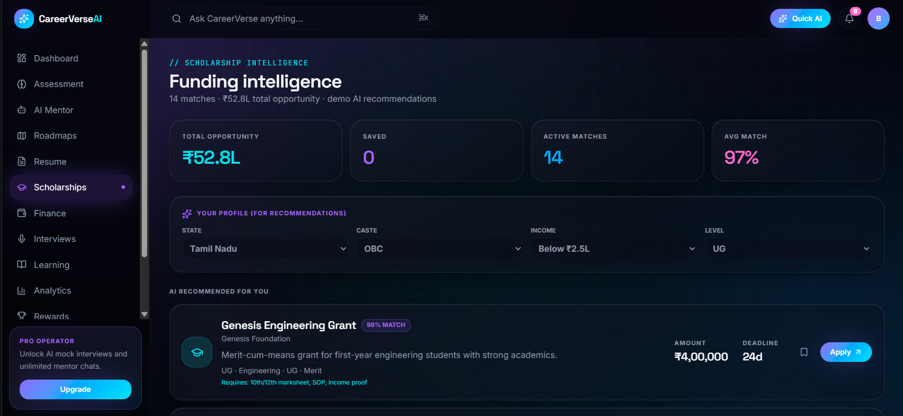

---

## 🛣️ Career Roadmaps
- Structured learning paths
- Tech stack recommendations
- Skill progression UI

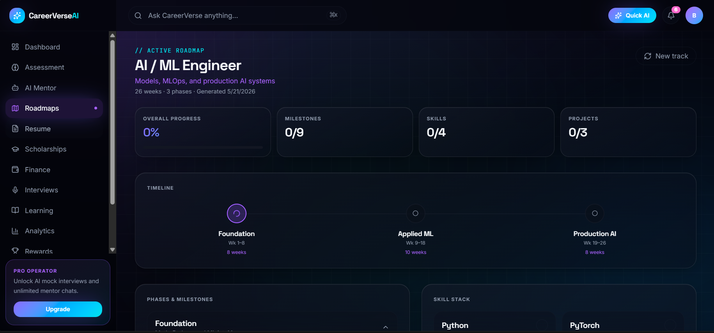

---

## 📚 Learning Dashboard
- Daily goals tracker
- Course library
- Study planner
- Progress monitoring

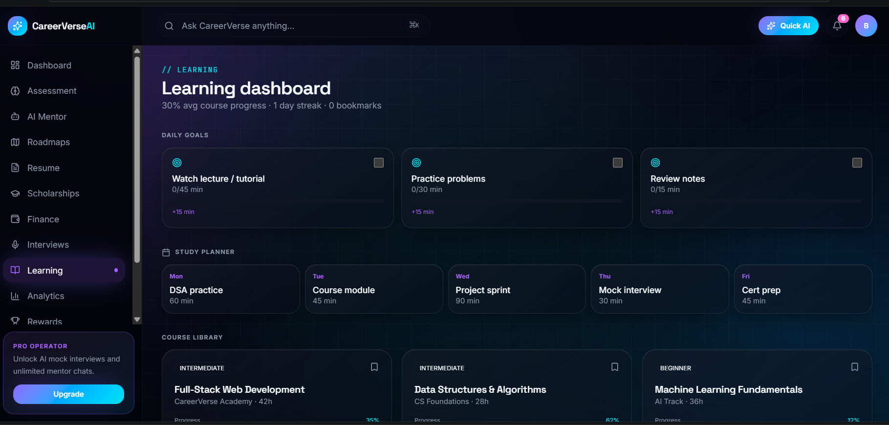

---

## 📊 Analytics Dashboard
- Progress analytics
- Learning statistics
- Interactive charts
- Performance insights

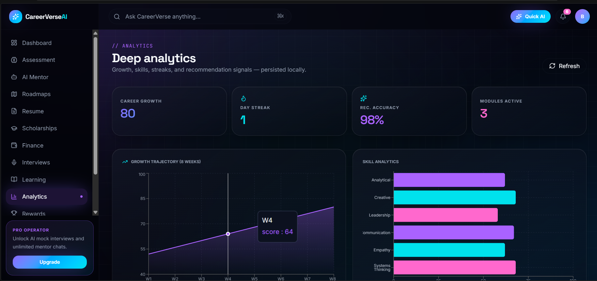

---

## 💼 Mock Interviews
- AI interview preparation UI
- Practice question workflow
- Performance-ready interface

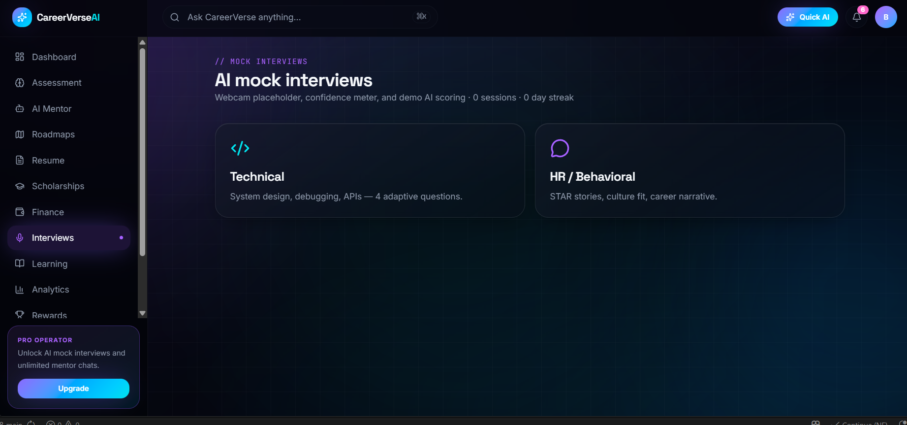

---

## 💰 Finance Dashboard
- Expense tracking UI
- Student finance planning
- Budget visualization

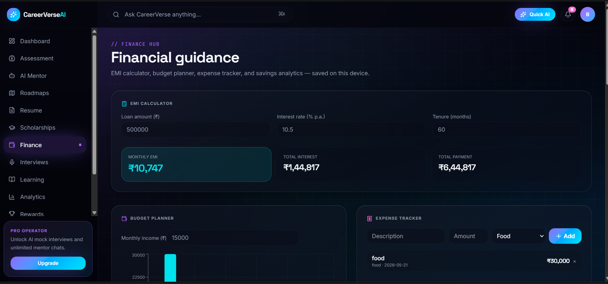

---

## ⚙️ Settings Panel
- User preferences
- Profile customization
- Notification management

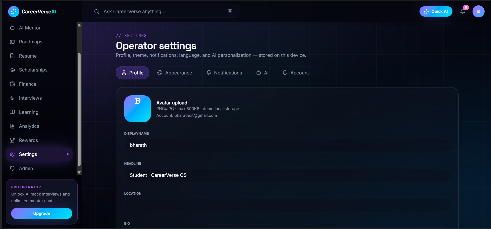

---

## 🛡️ Admin Panel
- Admin dashboard UI
- User management system
- Platform monitoring

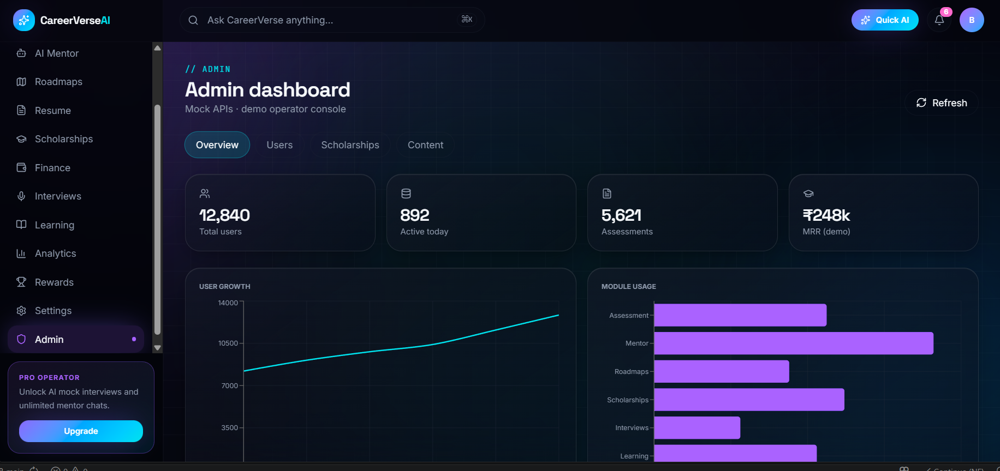

---

## 📝 Assessment Module
- Skill assessment dashboard
- Progress monitoring
- Performance evaluation UI

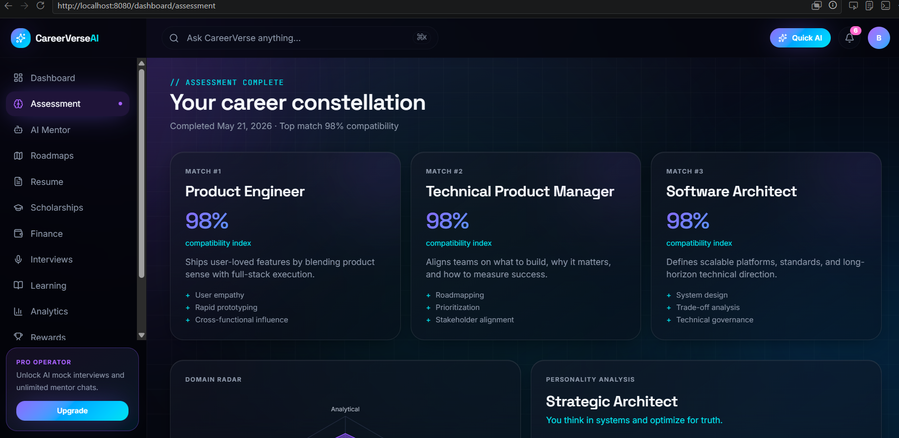

---

# 🏗️ Tech Stack

## Frontend
- React 19
- TanStack Start
- TanStack Router
- TypeScript
- Tailwind CSS
- ShadCN UI
- Radix UI
- Framer Motion
- Recharts

## Backend
- Node.js
- Express.js
- JWT Authentication
- REST APIs
- Zod Validation

## Deployment
- Vercel / Netlify (Frontend)
- Render / Railway (Backend)

---

# 🔐 Authentication Features

- User Signup/Login
- JWT Authentication
- Protected Routes
- Refresh Token Support
- Google Authentication Ready
- Forgot Password Flow

---

# 📂 Project Structure

```bash
careerverse-ai/
│
├── backend/
│   ├── src/
│   ├── routes/
│   ├── controllers/
│   ├── middleware/
│   └── services/
│
├── src/
│   ├── components/
│   ├── routes/
│   ├── lib/
│   ├── context/
│   └── dashboard/
│
├── Screenshots/
└── README.md

⚡ Installation
Clone Repository
git clone https://github.com/YOUR_USERNAME/careerverse-ai.git
cd careerverse-ai
📦 Install Dependencies
npm install
▶️ Run Frontend
npm run dev
▶️ Run Backend
npm run dev:api
▶️ Run Full Stack Together
npm run dev:all
🌐 Environment Variables

Create .env files.

Frontend
VITE_API_URL=http://localhost:5000
Backend
PORT=5000
JWT_SECRET=your_secret_key
🚀 Future Improvements
Real AI integration (OpenAI/Gemini)
Real scholarship APIs
Resume PDF parser
Voice-based mentor
AI-generated roadmaps
Mobile app version
Real-time notifications
Multi-user collaboration
👨‍💻 Developed By

Bharath

AI + Full Stack Developer Project

⭐ Support

If you like this project:

⭐ Star the repository
🍴 Fork the repo
📢 Share with others

📜 License

MIT License